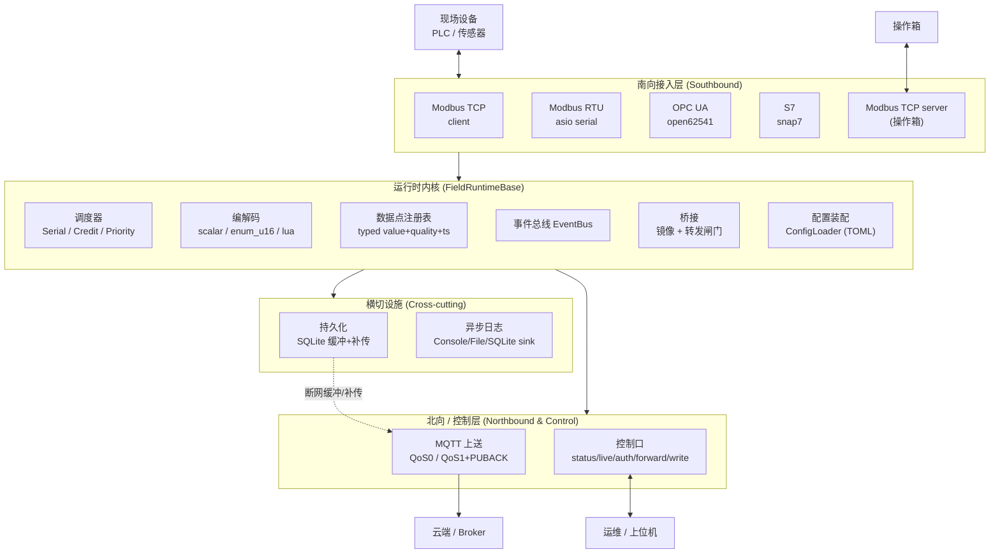
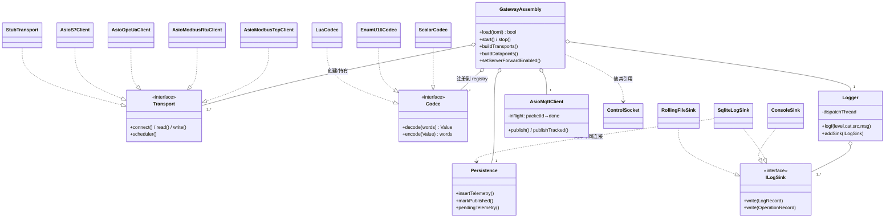
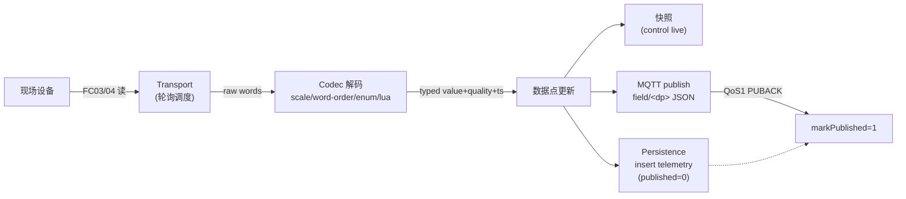
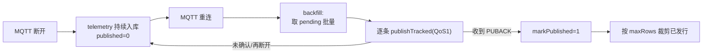
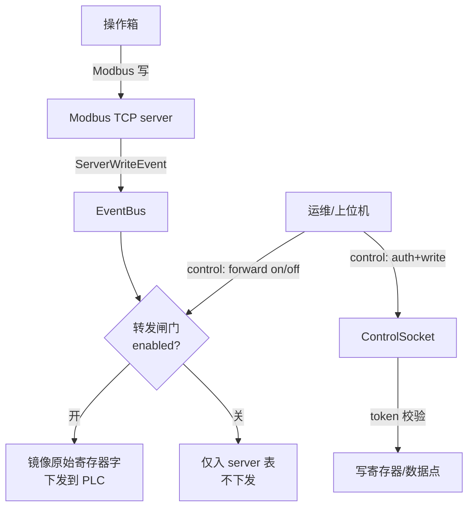
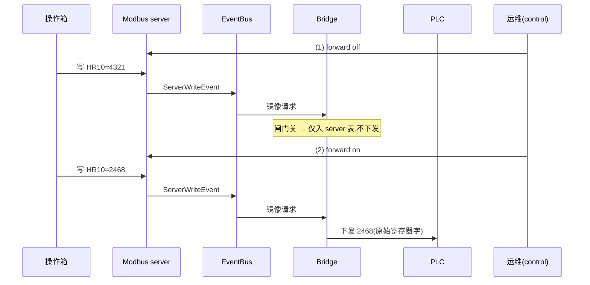
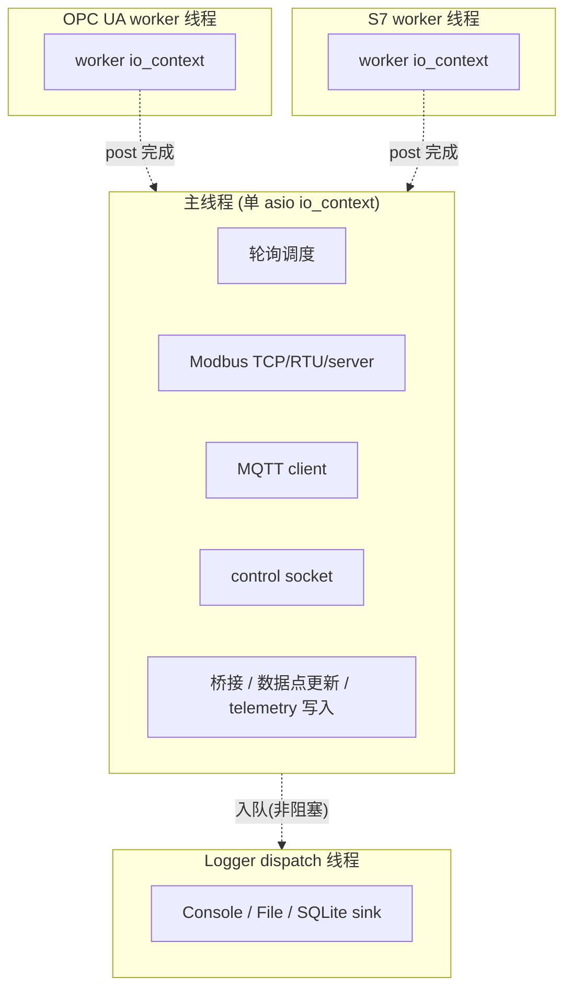
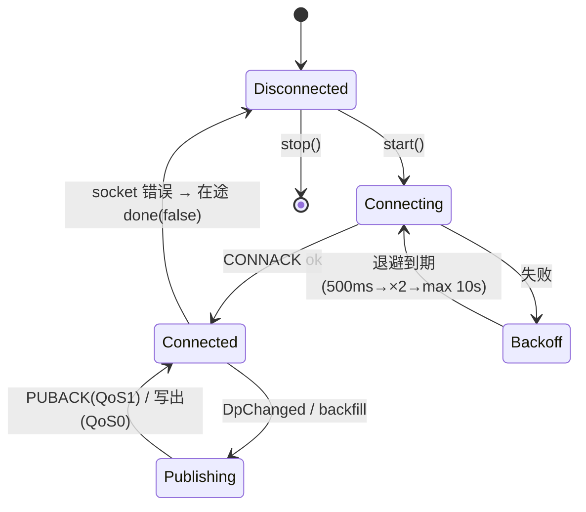
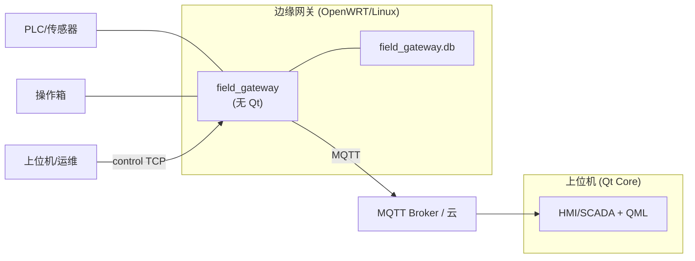

# FieldRuntime 产品技术文档

> 工业现场设备运行时(Industrial Field-Device Runtime)
> 适用版本:`core-base-split`(2.0.x)· 文档最近更新:2026-06-24

---

## 目录

1. [产品概述](#1-产品概述)
2. [产品功能架构图](#2-产品功能架构图)（必备图）
3. [模块关系图](#3-模块关系图)（必备图）
4. [核心数据流程图](#4-核心数据流程图)（必备图）
5. [构建目标与编译矩阵](#5-构建目标与编译矩阵)
6. [子系统详解](#6-子系统详解)
7. [扩展图:时序 / 线程 / 状态机 / 部署](#7-扩展图)
8. [配置参考(TOML)](#8-配置参考toml)
9. [控制协议参考](#9-控制协议参考)
10. [术语表](#10-术语表)

---

## 1. 产品概述

**FieldRuntime** 是一个 **C++23** 的工业现场设备运行时,用于把现场 PLC / 传感器
/ 操作箱的数据,经协议采集 → 类型化 → 路由 → 上送/落盘/受控下发,组装成可独立部署
的现场网关或嵌入 HMI/SCADA 的数据底座。

### 1.1 设计原则

| 原则 | 含义 |
|------|------|
| **无 Qt 内核** | 类型与算法全部沉淀在 `FieldRuntimeBase`(纯 C++,`CORE_WITH_QT=OFF` 可独立构建),Qt 仅是**可选适配层**,而非内核依赖 |
| **接口先行** | 南向 `transport::Transport`、日志 `ILogSink`、编解码 `codec::Codec`、插件 `Plugin` 均为抽象接口,实现可替换 |
| **声明式装配** | 协议、轮询、编解码、数据点、桥接全部由 TOML 声明,运行时按 schema 装配,不写死 |
| **单线程事件循环 + 隔离 worker** | 主路径在单个 asio `io_context` 上无锁推进;重协议(OPC UA/S7)各自隔离在 worker 线程,完成后 `post` 回主循环 |

### 1.2 典型场景

- 现场数据网关(采集 → MQTT 上云 + 断网缓冲补传)
- 操作箱 ↔ PLC 镜像/转发(带受控闸门)
- 边缘采集器 / OpenWRT 路由器内常驻 daemon
- HMI/SCADA 应用的协议与数据底座(Qt 适配层 + QML 桥)

---

## 2. 产品功能架构图

> **必备图 ①** —— 分层功能架构:南向采集 / 运行时内核 / 北向与控制 / 横切设施。



**分层职责**

| 层 | 职责 | 关键组件 |
|----|------|---------|
| 南向接入 | 把异构现场协议归一成「读寄存器/节点 + 写寄存器」 | `AsioModbusTcpClient` / `AsioModbusRtuClient` / `AsioOpcUaClient` / `AsioS7Client` / `AsioModbusTcpServer` |
| 运行时内核 | 调度采集、解码成类型化数据点、事件分发、桥接 | `*Scheduler` / `CodecRegistry` / `DatapointRegistry` / `EventBus` / `GatewayAssembly` |
| 北向/控制 | 数据上送与受控运维接口 | `AsioMqttClient` / `ControlSocket` |
| 横切设施 | 断网不丢数据、可观测 | `Persistence` / `Logger` + `ILogSink` |

---

## 3. 模块关系图

> **必备图 ②** —— 组件依赖与装配关系(谁创建谁、谁依赖谁)。



**关键关系说明**

- `GatewayAssembly` 是**装配根(composition root)**:读 TOML → 注册 codec → 建
  transport → 建 datapoint → 建桥接 → 拉起 MQTT/持久化/日志 sink。
- `Transport` / `Codec` / `ILogSink` 三个抽象接口是**扩展点**:新增协议/编解码/日志
  目的地只需实现接口并在装配处接线,不动内核。
- `SqliteLogSink` 与 `Persistence` 写**同一个 SQLite 文件但各持独立连接**(分别在
  Logger dispatch 线程与 io 线程),靠 WAL + busy_timeout 协调。

---

## 4. 核心数据流程图

> **必备图 ③** —— 上行采集链路 + 下行受控写入链路。

### 4.1 上行(采集 → 上送 / 落盘)



### 4.2 断网缓冲与补传



### 4.3 下行(操作箱 / 运维 → PLC,带转发闸门)



---

## 5. 构建目标与编译矩阵

FieldRuntime 提供**三个构建目标**:

| 目标 | 类型 | 含 Qt | 内容 | 适用 |
|------|------|:----:|------|------|
| `FieldRuntimeBase` | STATIC | 否 | 无 Qt 的类型 + 算法:config/datapoint/bus/log/scheduler/codec/transport 抽象 | 嵌入式 / OpenWRT / 链入 daemon |
| `Core` | SHARED | 是 | Qt 装配:QModbus/OPC UA/MQTT + QML 桥 + SQL | HMI/SCADA 桌面/上位机 |
| `FieldRuntimeGateway` | exe | 否 | asio 事件循环 + nanoMODBUS 实现 `transport::Transport`,链 `FieldRuntimeBase` | 现场网关 / OpenWRT daemon |

### 5.1 关键编译开关

```bash
# 默认:完整 Qt 构建(Core + 测试 + 示例)
cmake -S . -B build

# 仅无 Qt 基座 + 头自检红线
cmake -S . -B build-base -DCORE_WITH_QT=OFF

# 无 Qt 网关(全量南向协议)
cmake -S . -B build-gw -DCORE_WITH_QT=OFF -DCORE_BUILD_GATEWAY=ON

# 精简 Modbus-only 网关(关 OPC UA/S7/web_console,依赖最小)
cmake -S . -B build-lean -DCORE_WITH_QT=OFF -DCORE_BUILD_GATEWAY=ON \
  -DCORE_BUILD_WEB_CONSOLE=OFF -DGATEWAY_ENABLE_OPCUA=OFF -DGATEWAY_ENABLE_S7=OFF
```

| 选项 | 默认 | 作用 |
|------|:---:|------|
| `CORE_WITH_QT` | ON | 关闭则只构建 `FieldRuntimeBase` |
| `CORE_BUILD_GATEWAY` | OFF | 构建无 Qt 网关 exe |
| `CORE_BUILD_WEB_CONSOLE` | ON | 构建 web_console 示例(Drogon),精简构建可关 |
| `GATEWAY_ENABLE_OPCUA` | ON | 南向 OPC UA(open62541),关则不拖该依赖 |
| `GATEWAY_ENABLE_S7` | ON | 南向 S7(snap7),关则不拖该依赖 |

> **依赖梯度**:全量网关需 `async_simple + asio + sqlite3 + tomlplusplus + open62541 + snap7`;
> 精简(关 OPC UA/S7)只剩前 4 个轻量依赖,大幅降低交叉编译(OpenWRT/musl)面。

---

## 6. 子系统详解

### 6.1 南向 Transport

统一抽象 `transport::Transport`,把异构协议归一成「读/写 + 调度统计」。已实现:

| 协议 | 实现 | 要点 |
|------|------|------|
| Modbus TCP client | `AsioModbusTcpClient` | nanoMODBUS over asio,FC03/04/16,真异步读写 + `steady_timer` 超时(哑 PLC 不冻 loop) |
| Modbus RTU | `AsioModbusRtuClient` | asio `serial_port`,RTU 帧 `[unitId][PDU][CRC16]`,半双工钳 `maxInflight=1` |
| OPC UA | `AsioOpcUaClient` | open62541,隔离在 worker io_context/线程,完成 `post` 回主 io |
| S7 | `AsioS7Client` | snap7 `Cli_DBRead/DBWrite`,addr=字索引,worker 线程隔离 |
| Modbus TCP server | `AsioModbusTcpServer` | 操作箱接入,写请求发 `ServerWriteEvent` 进总线 |

### 6.2 编解码 Codec

`codec::Codec` 把原始寄存器字 ↔ 类型化 `dp::Value`:

- **scalar**:按 `scale` / `word_order`(大小端、字序)线性变换,支持多寄存器 U32 等。
- **enum_u16**:u16 → 枚举字符串(如 `0=stop,1=run,2=fault`)。
- **lua**:SOL2 执行脚本做复杂变换(Qt Core 侧;`CORE_BUILD_LUA`)。

> 配置中的 `[[codec]]` 必须在 `buildDatapoints()` **之前**注册,否则数据点会静默回退
> scalar(历史 F2 修复点)。

### 6.3 调度器 Scheduler

| 类型 | 适用 |
|------|------|
| **Serial** | 半双工总线(RTU)——严格串行,一问一答 |
| **Credit** | 限流配额,平衡多 range 轮询节奏 |
| **Priority** | 关键点优先采集 |

### 6.4 数据点 Datapoint

类型化「值 + 质量(quality)+ 时间戳(ts)」三元组。来源由 `[datapoint.source]`
绑定到某 transport 的寄存器/节点。更新后同时驱动:快照(control live)、北向上送、
持久化入库。

### 6.5 桥接 Bridge

- **镜像**:PLC ↔ 操作箱**原始寄存器字**双向拷贝(保留 scale/多寄存器语义,历史 F3 修复点)。
- **转发闸门**:`setServerForwardEnabled(server, bool)` 控制操作箱写入是否真正下发到 PLC。

### 6.6 北向 MQTT

手写最小 MQTT 3.1.1。`DpChanged → publish field/<dp> JSON`。

- **QoS0**:`done` 在 socket 写出即回调(旧语义)。
- **QoS1+PUBACK**:PUBLISH 带 2 字节 packet-id,维护 `packetId→done` 在途表,
  **仅在收到对应 PUBACK 时确认**;断开/停止时对在途 `done(false)`,交回持久化补传
  (at-least-once)。`published` 标记因此真实代表「broker 已确认」。

### 6.7 控制口 ControlSocket

asio TCP,行协议 + JSON。只读 `status`/`live`/`help`;写面 `auth`/`forward`/`write`
需 token 鉴权。详见 [§9](#9-控制协议参考)。

### 6.8 持久化 Persistence

SQLite(WAL),两张表:

- **telemetry**:`(dp_id,value,quality,ts,published)`,断网缓冲 + 重连补传 + 按
  `maxRows` 裁剪已发行行。
- **logs**:`(level,module,key,msg,ts)`,由 `SqliteLogSink` 写入。

### 6.9 日志 Logger + Sink

异步:emit 端**线程安全、非阻塞、只写**(任意线程可调);记录入有界队列,在**单条
dispatch 线程**上 fan-out 给各 sink。内置 sink:`ConsoleSink`、`RollingFileSink`、
`SqliteLogSink`。因为所有 sink 都在该单线程上被调用,SQLite sink 只需持有自有连接
即天然线程安全。

---

## 7. 扩展图

### 7.1 时序图:操作箱写入 + 转发闸门



### 7.2 线程模型



### 7.3 MQTT 连接状态机



### 7.4 部署形态



---

## 8. 配置参考(TOML)

```toml
[meta]
project   = "field_gateway_modbus"
log_level = "info"               # trace/debug/info/warn/error/critical

[control]
listen_port = 15022              # 控制口端口
# token = "..."                  # 写面鉴权 token

[northbound.mqtt]
enable       = true
host         = "127.0.0.1"
port         = 1883
client_id    = "field_gateway"
keepalive_s  = 30
topic_prefix = "field"           # 上送主题前缀 field/<dp>
qos          = 1                 # 0 或 1(QoS1 带 PUBACK 确认)

[persistence]
enable        = true
path          = "field_gateway.db"
max_rows      = 100000           # telemetry 上限,超出裁剪已发行行
backfill_batch = 32              # 每次补传批量

[[codec]]                        # 必须在 datapoint 之前
id   = "run_state"
kind = "enum_u16"                # scalar / enum_u16 / lua
# map = { 0="stop", 1="run", 2="fault" }

[[transport]]
id   = "mock_plc"
kind = "modbus_tcp_client"       # modbus_tcp_client/server, modbus_rtu, opc_ua_client, s7_client
host = "127.0.0.1"
port = 15020
[transport.scheduler]
kind = "credit"                  # serial / credit / priority

[[poll_range]]
transport = "mock_plc"
range     = [0, 12]

[[datapoint]]
id    = "rtu.temperature"
kind  = "Status"
codec = "..."
scale = 0.1
[datapoint.source]
port  = "mock_plc"
# register/address...

[[bridge]]                       # 操作箱 ↔ PLC 镜像/转发
# server = "opbox"; target = "mock_plc"; ...
```

> RTU 专用字段:`[[transport]]` 下 `port_name`(串口)、`baud_rate`、`slave_id`。

---

## 9. 控制协议参考

控制口为 **asio TCP,行协议**(每行一命令,响应为 JSON 或文本)。

| 命令 | 鉴权 | 说明 |
|------|:---:|------|
| `status` | 否 | 各 transport 连接态 + `scheduler().stats()` |
| `live` | 否 | 全部数据点当前 `{id,value,quality,ts}` |
| `help` | 否 | 命令清单 |
| `auth <token>` | — | 开启本连接写面权限 |
| `forward <server> on\|off` | 是 | 切换某 server 的转发闸门 |
| `write <transport> <area> <addr> <value>` | 是 | 写寄存器/数据点 |

**示例**

```
> live
{"datapoints":[{"id":"rtu.temperature","value":23,"quality":"Ok","ts":...}, ...]}

> write mock_plc HR 11 1234        # 未鉴权 → unauthorized
> auth s3cr3t
ok
> write mock_plc HR 11 1234         # 鉴权后 → 写入 + 上送
ok
```

---

## 10. 术语表

| 术语 | 含义 |
|------|------|
| **datapoint(数据点)** | 类型化的「值 + 质量 + 时间戳」三元组,运行时的最小数据单元 |
| **transport** | 南向协议抽象,提供读/写/调度 |
| **codec** | 原始寄存器字 ↔ 类型化值的编解码 |
| **bridge(桥接)** | 操作箱 ↔ PLC 的镜像与转发 |
| **forward gate(转发闸门)** | 控制操作箱写入是否真正下发到 PLC 的开关 |
| **backfill(补传)** | MQTT 重连后,把断网期间缓冲的 telemetry 批量重发 |
| **published** | telemetry 行是否已被 broker 确认(QoS1 下 = 收到 PUBACK) |
| **sink** | 日志目的地(Console/File/SQLite) |

---

> 相关文档:`README.md`(目标与构建矩阵)、`docs/zh/README.md`(子系统详解)、
> `coord/ROADMAP.md`(开发路线与里程碑)。
